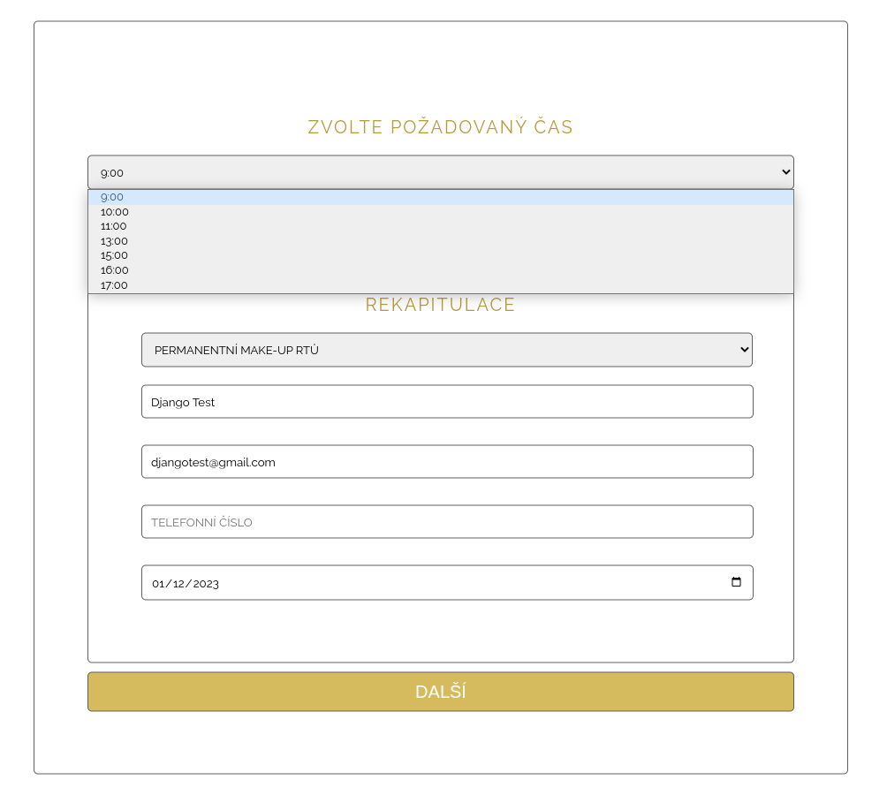
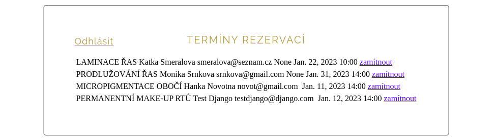
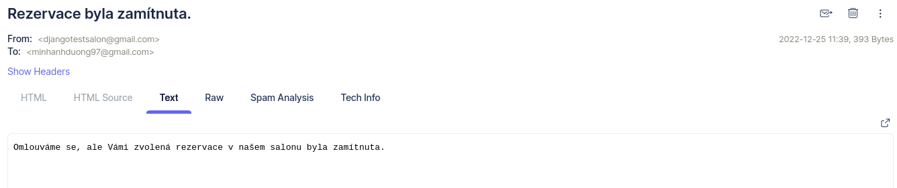

# Beauty salon website
Built on Django.

## Features
- Booking page where clients can book appointments at available times
- Logged in user can see bookings and manage appointments
- In case of cancellation of an appointment by the salon, an email is sent to the client
- Contact form that sends emails to the salon

## How to start
The application is not ready for production.
Launch the app to preview
- Installation requirements
- Start the Django development server from the project root.

$ python manage.py migrate

$ python manage.py runserver

- Visit main page: [beauty-salon] http://127.0.0.1:8000/beauty-salon/
- visit booking page: [beauty-salon/reservation/] http://127.0.0.1:8000/beauty-salon/reservation/

## App preview
- booking page (time 14:00 on 12.01.2023 is not available, is already booked)
 
- list of reservations for logged-in users
 
- email when cancelling a reservation
 
